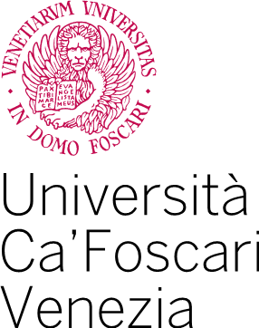

# TurtleBot3

<a>
    
</a>

Authors: 
- Mattia Dei Rossi - [885768@stud.unive.it](885768@stud.unive.it)
<!-- ## Local workspace setup
Install [vcstool](https://github.com/dirk-thomas/vcstool)
```
vcs import < repos.yaml
``` -->

## Docker
<!-- ```
sudo xhost local:docker
``` -->
<!-- ```
docker compose up
```

## Zenoh Debug
```
``` -->


## On robot or simulation
1. Launch simulation or real robot with navigation stack
```
export ROS_DOMAIN_ID=112
export ROS_LOCALHOST_ONLY=1
export RMW_IMPLEMENTATION=rmw_cyclonedds_cpp
ros2 launch webots_ros2_turtlebot robot_launch.py nav:=true
```
2. Launch zenoh bridge
```
export ROS_DOMAIN_ID=112
export ROS_LOCALHOST_ONLY=1
export RMW_IMPLEMENTATION=rmw_cyclonedds_cpp
zenoh-bridge-ros2dds -c zenoh/config.json5
```
3. Test Zenoh REST API
```
curl http://localhost:8000/@ros2/turtlebot3/route/topic/**
```


```
flask --app server run
```

## On client 
```
./zenoh-bridge-ros2dds -e tcp/0.0.0.0:7447 -i 0A0B23 --rest-http-port 8002
```
## Admin space via REST
```
curl http://localhost:8002/@ros2/0A0B23/route/topic/**
```
## Launch foxglove bridge on Client
```
export ROS_DOMAIN_ID=112
export ROS_LOCALHOST_ONLY=1
export RMW_IMPLEMENTATION=rmw_cyclonedds_cpp
ros2 launch foxglove_bridge foxglove_bridge_launch.xml
```
## Launch foxglove studio on Client
```
docker run --rm -p "8080:8080" -v /path/to/custom_layout.json:/foxglove/default-layout.json ghcr.io/foxglove/studio:latest
```

## Go
[http://localhost:8080](http://localhost:8080)