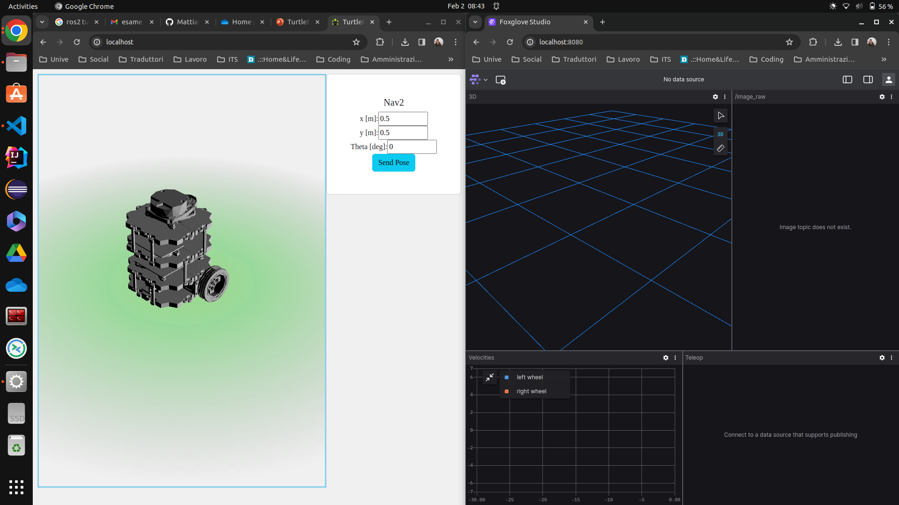

# TurtleBot3

<a>
    
</a>

Authors: 
- Mattia Dei Rossi - [885768@stud.unive.it](885768@stud.unive.it)

## On robot / simulation
1. Install `zenoh-bridge-ros2dds`
```bash
echo "deb [trusted=yes] https://download.eclipse.org/zenoh/debian-repo/ /" | sudo tee -a /etc/apt/sources.list > /dev/null
sudo apt update
sudo apt install zenoh-bridge-ros2dds
```
2. Launch simulation or real robot with navigation stack
```bash
export ROS_DOMAIN_ID=111
export ROS_LOCALHOST_ONLY=1
export RMW_IMPLEMENTATION=rmw_cyclonedds_cpp
ros2 launch webots_ros2_turtlebot robot_launch.py nav:=true
```
Launch camera node
```bash
ros2 run usb_cam usb_cam_node_exe
```
3. Launch zenoh bridge
```bash
# sudo ip l set lo multicast on
export ROS_DOMAIN_ID=111
export ROS_LOCALHOST_ONLY=1
export RMW_IMPLEMENTATION=rmw_cyclonedds_cpp
zenoh-bridge-ros2dds -l tcp/0.0.0.0:7447 --rest-http-port 8000
```

## On client
<!-- 1. Launch zenoh bridge
```bash
export ROS_DOMAIN_ID=333
export ROS_LOCALHOST_ONLY=1
export RMW_IMPLEMENTATION=rmw_cyclonedds_cpp
zenoh-bridge-ros2dds -l tcp/<robot-ip>:7447
``` -->
0. Set <robot-ip> in docker compose file
```bash
zenoh-bridge:
image: eclipse/zenoh-bridge-ros2dds:nightly
container_name: zenoh-bridge
environment:
    - ROS_DISTRO=humble
    - ROS_DOMAIN_ID=1
    - ROS_LOCALHOST_ONLY=1
    - RMW_IMPLEMENTATION=rmw_cyclonedds_cpp
network_mode: host
# networks:
#   - turtlebot_net
# ports:
#   - 7449:7447
#   - 8002:8002
command: -e tcp/<robot-ip>:7447 

```

1. Run Rosbridge + App + FoxgloveStudio + zenoh bridge
```
docker compose up
```
2. Go to
- ( App ) Web App [http://localhost:80/](http://localhost:80/)
- ( FoxgloveStudio ) Foxglove [http://localhost:8080/](http://localhost:8080/)

4. Test Zenoh REST API
```bash
curl http://<robot-ip>:8000/@ros2/turtlebot3/route/topic/**
```


## Expected result

